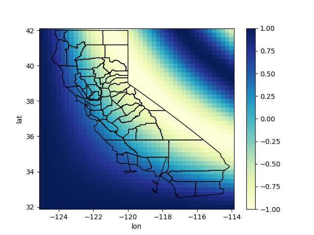
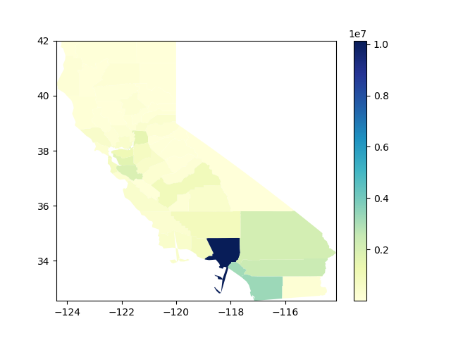
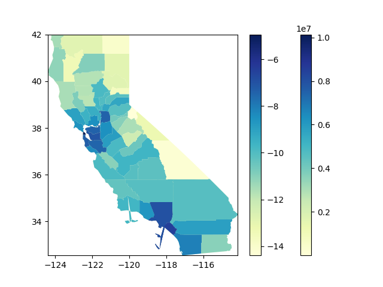

======
xshape
======

.. image:: https://img.shields.io/pypi/v/xshape.svg
        :target: https://pypi.python.org/pypi/xshape

.. image:: https://img.shields.io/travis/ClimateImpactLab/xshape.svg
        :target: https://travis-ci.org/ClimateImpactLab/xshape

.. image:: https://readthedocs.org/projects/xshape/badge/?version=latest
        :target: https://xshape.readthedocs.io/en/latest/?badge=latest
        :alt: Documentation Status

.. image:: https://pyup.io/repos/github/ClimateImpactLab/xshape/shield.svg
     :target: https://pyup.io/repos/github/ClimateImpactLab/xshape/
     :alt: Updates

Tools for working with shapefiles, topographies, and polygons in xarray

* Free software: MIT license
* Documentation: https://xshape.readthedocs.io.

Features
--------

* Read a shapefile and obtain an xarray DataArray of field records
* Draw shapefile boundaries on gridded data
* Plot xarray DataArray data indexed by shapefile records as a choropleth

Usage
-----

Getting records for fields in a shapefile
~~~~~~~~~~~~~~~~~~~~~~~~~~~~~~~~~~~~~~~~~

.. code-block:: python

    In [1]: import xshape

    In [2]: fields, polygons = xshape.parse_shapefile(
       ...:     'tests/data/shapefiles/CA_counties/CA_counties',
       ...:     encoding='latin1')

    In [3]: fields
    Out[3]: 
    <xarray.Dataset>
    Dimensions:   (shape: 58)
    Coordinates:
      * shape     (shape) int64 0 1 2 3 4 5 6 7 8 9 10 11 12 13 14 15 16 17 18 ...
    Data variables:
        STATEFP   (shape) <U22 '06' '06' '06' '06' '06' '06' '06' '06' '06' '06' ...
        COUNTYFP  (shape) <U22 '107' '009' '047' '079' '097' '041' '023' '051' ...
        COUNTYNS  (shape) <U22 '00277318' '01675885' '00277288' '00277304' ...
        GEOID     (shape) <U22 '06107' '06009' '06047' '06079' '06097' '06041' ...
        NAME      (shape) <U22 'Tulare' 'Calaveras' 'Merced' 'San Luis Obispo' ...
        NAMELSAD  (shape) <U22 'Tulare County' 'Calaveras County' ...
        LSAD      (shape) <U22 '06' '06' '06' '06' '06' '06' '06' '06' '06' '06' ...
        CLASSFP   (shape) <U22 'H1' 'H1' 'H1' 'H1' 'H1' 'H1' 'H1' 'H1' 'H1' 'H1' ...
        MTFCC     (shape) <U22 'G4020' 'G4020' 'G4020' 'G4020' 'G4020' 'G4020' ...
        CSAFP     (shape) <U22 '' '' '' '' '488' '488' '' '' '' '' '488' '472' ...
        CBSAFP    (shape) <U22 '47300' '' '32900' '42020' '42220' '41860' ...
        METDIVFP  (shape) <U22 '' '' '' '' '' '41884' '' '' '' '' '36084' '' '' ...
        FUNCSTAT  (shape) <U22 'A' 'A' 'A' 'A' 'A' 'A' 'A' 'A' 'A' 'A' 'A' 'A' ...
        ALAND     (shape) <U22 '12494707314' '2641820029' '5011554680' ...
        AWATER    (shape) <U22 '37391604' '43810423' '112760479' '820974619' ...
        INTPTLAT  (shape) <U22 '+36.2288317' '+38.1846184' '+37.1948063' ...
        INTPTLON  (shape) <U22 '-118.7810618' '-120.5593996' '-120.7228019' ...

Drawing shape boundaries on gridded data
~~~~~~~~~~~~~~~~~~~~~~~~~~~~~~~~~~~~~~~~

.. code-block:: python

    In [4]: import xarray as xr, numpy as np, xshape

    # generate sample data
    In [5]: da = xr.DataArray(
       ...:    np.cos((
       ...:         np.arange(41*45).reshape((41, 45)) * np.arange(41*45).reshape((45, 41)
       ...:         ).T)/4e5),
       ...:    dims=('lat', 'lon'),
       ...:    coords={
       ...:        'lon': np.linspace(-125, -114, 45),
       ...:        'lat': np.linspace(32, 42, 41)})
       ...:

    In [6]: da.xshape.overlay(
       ...:     'tests/data/shapefiles/CA_counties/CA_counties',
       ...:     encoding='latin1',
       ...:     cmap='YlGnBu');
       ...:

Plotting regional data in a choropleth
~~~~~~~~~~~~~~~~~~~~~~~~~~~~~~~~~~~~~~

Using the xarray extension, we can plot ``DataArray`` data directly:

.. code-block:: python

    In [7]: import xshape, xarray as xr, pandas as pd

    In [8]: df = pd.read_csv('tests/data/datasets/co-est2016.csv', encoding='latin1')
       ...: ca = df[(df['STATE'] == 6) & (df['COUNTY'] > 0)].copy()
       ...: ca['fips'] = df['STATE'] * 1000 + df['COUNTY']
       ...: da = ca.set_index(['fips'])['POPESTIMATE2016'].to_xarray()
       ...: da.coords['GEOID'] = ('fips', ), list(map('{:05}'.format, da.fips.values))
       ...: da = da.swap_dims({'fips': 'GEOID'})

    In [9]: da.xshape.plot(
       ...:     'tests/data/shapefiles/CA_counties/CA_counties',
       ...:     encoding='latin1',
       ...:     cmap='YlGnBu');
       ...:

We can also combine the information from the fields with the data contained in the DataArray:

.. code-block:: python

    In [10]: land_area = (
       ....:     fields
       ....:     .set_coords('GEOID')
       ....:     .swap_dims({'shape': 'GEOID'})
       ....:     .ALAND.astype(float))

    In [11]: np.log(da / land_area).xshape.plot(
       ....:     'tests/data/shapefiles/CA_counties/CA_counties',
       ....:     encoding='latin1',
       ....:     cmap='YlGnBu');
       ....:

TODO
----

* Use shapefiles to reshape gridded/pixel data
